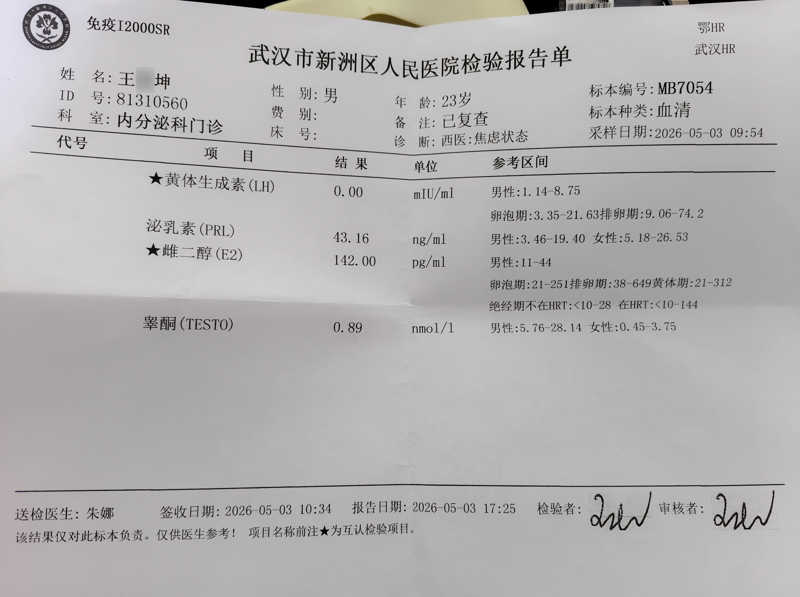
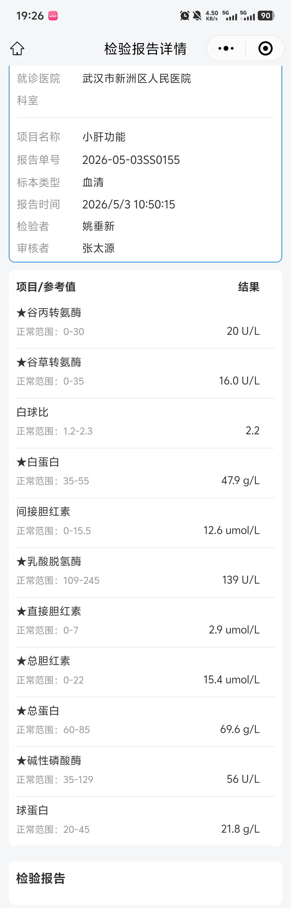
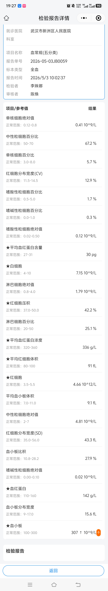

#  此篇为向医生寻求开证及精神诊断的说明。

 
 

# 主诉：

1.希望开具“性身份障碍”相关诊断证明，以获得正规渠道HRT药物；

2.评估精神心理状态（长期抑郁、焦虑、创伤相关症状），预启动精神药物干预；

3.请医生就目前无法维持正常学业休学想法给出建议。

## 是否正在进行 HRT

 

是，在进行无证HRT，已经持续4个月。

近期HRT药物使用情况为：德贴日常保持2贴，色谱龙（醋酸环丙孕酮）每两天12.5mg，B族维生素片每日1片。

夏日来临，打算雌的部分转凝胶或者药片。

 
 

## 什么时候开始出现相关想法

 

性别疑惑在幼时大概6岁左右就有了，那时帮病重的母亲扣内衣、穿衣服，就感觉自己未来也会穿内衣和裙子。

 

小学时想和女生玩，但是注意到娘娘腔群体很不受待见，所以就没敢，但也没怎么和男生玩。

经历过一系列重大创伤事件（比如母亲想杀死我等等）后变得麻木、自闭，压抑了自己的想法，更不愿意开口表达。

 

小学后半段以及初中忍不住多次偷穿母亲的内衣、裙子、大一、裤子、鞋子，用母亲的护肤保养品等。

母亲不在家时一穿就是一天。

初中被母亲发现制止后仍然停不下来这一行为。

变声期后就感觉有些不适。

母亲说我声音变低变粗了就焦虑起来了，后来母亲说我不爱说话了。

首次了解到自慰并尝试的时间是在初中毕业后休学的那一年。

日常里被调侃到“像个女孩子一样”会暗自开心。

行为表现上也和传统的男生刻板印象表现不符。

 

高中在外租房陪读，压力大，没时间精力去穿这些东西了。

但是男性第二性征开始发育明显时，感到很厌恶和不安。

胡子、腋毛、阴毛变得粗黑浓密，汗毛加重、喉结突出、骨骼发育、脸大下巴方、下体不自觉勃起都会感到焦虑，同时加剧厌恶第一性征。

那会信息闭塞，不知道性别焦虑、跨性别这些概念。

 

大学时开始主动往这方面了解

逐渐详细了解到“性别焦虑”、“药娘”、“雌二醇”、“睾酮”、“跨性别”、“mtf”、“srs”等相关内容。

后逐渐确认自己应该就是。

随后去了解药物作用、副作用、渠道、跨性别处境等等。

 
 

## 是否存在抑郁、焦虑等情况

 

存在

 

极端行为史：回想起来，其实是有极端行为史的（我之前以为常见的割手腕割大腿才算的），包括但不限于：少时的主动撞墙到昏迷，初中的自闭绝食到低血糖昏迷，离家出走，主动触电。

 

极端想法史：存在且持续，起始点在少时创伤之后，驱动了后续的撞墙、绝食、离家出走、触电。那时甚至思考规划过包括但不限于割腕、煤气中毒、烧炭、跳楼、跳河等等。

好在那会自闭，并没有了解到“改花刀”和“od”，不然可能会更严重。

但还是有很多初中高中的极端的行为和想法我都想不起来了，我也记不清那时写过的遗书的内容了。

 

近期：HRT后性别焦虑有所缓解，虽然由于社恐自闭，没怎么出门，但仍然有性别焦虑，希望开出小证获得正规渠道拿药。

对学校及其焦虑，没什么课后，在学校待不了两天就逃回家了，在学校的时候也不去上课，实验不去，考试也不去考，饮食方面也不规律，睡眠很差，晚睡失眠早醒常发，经常一晚上睡不到5个小时（大一大二的时候没开始HRT时特别嗜睡，低精力，对什么都没什么兴趣）。

在家里一个人呆着的时候就还好，但是一旦有第二个人在身边，比如母亲，就会感到不安。

但是一旦学校那边的事情联系过来，马上就会全身发热出汗、心悸，然后陷入焦虑抑郁状态，导致近期睡眠也不好，多次睡不到5小时就早醒了，状态低迷。

有强烈的休学想法，有一定的休学规划。

 

记忆力下降：经常忘记是否吃过色谱龙，有时甚至出现幻觉觉得自己吃了，因此需要在一些药物浓度预测的网站上做记录，但是有时吃完就忘记做记录了。

另外，就是因为记忆力下降，所以不敢贸然要精神药物吃，因为可能会出现到了晚上不记得自己上午有没有吃药的情况了，（也怕自己不自觉od）。

 

疑病：有时怀疑自己是不是在装病，有时又在怀疑自己是不是抑郁转双相了，有时又在确认自己应该是C-PTSD，有时又在想自己是不是解离了......

 
 

## 是否能够接受 HRT 带来的不可逆作用

 

能

我了解HRT带来的不可逆作用，包括但不限于：生育功能障碍至永久性生育功能丧失，乳腺发育等。

 
 

## 家长支持情况

 

父亲理解支持。

母亲未知。

 
 

## 一些常规检查结果：

 
 

雌二醇：142 pg/mL    

（男性:11-44；卵泡期:21-251；排卵期:38-649；黄体期:21-312；绝经期不在HRT:<10-28；在HRT:<10-144）

 

睾酮：  0.89 nmo/L   （男性:5.76-28.14 女性:0.45-3.75）

 

泌乳素：43.16 ng/mL  （男性:3.46-19.40 女性:5.18-26.53）

 
 
 

 
 

 
 

