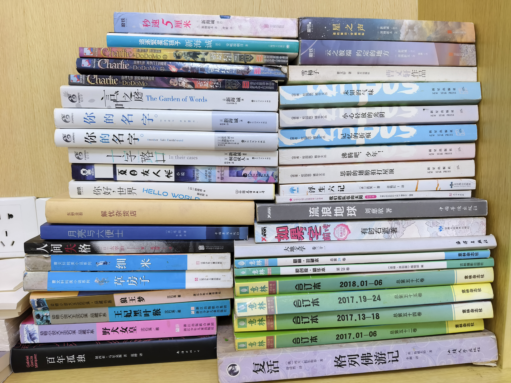
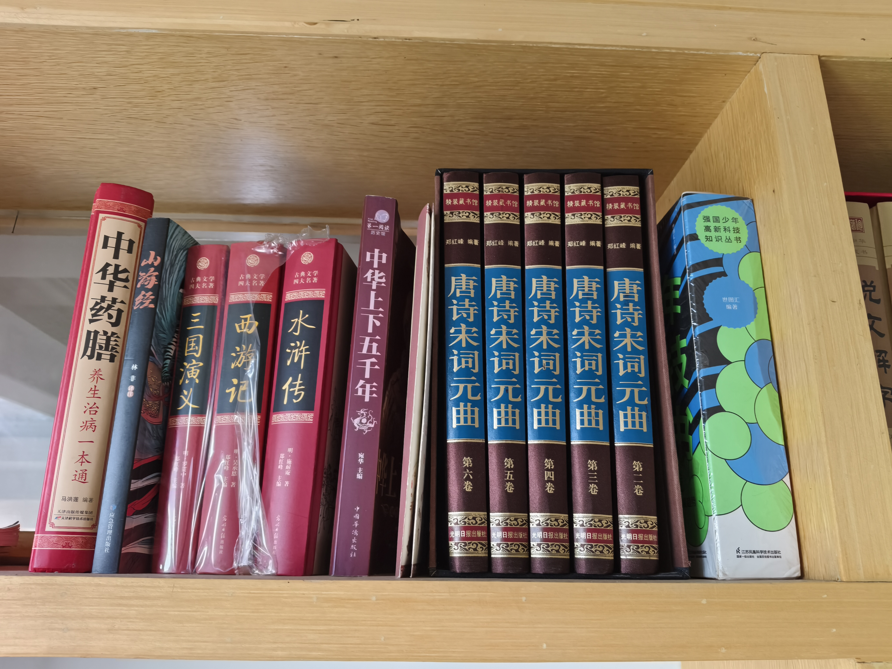
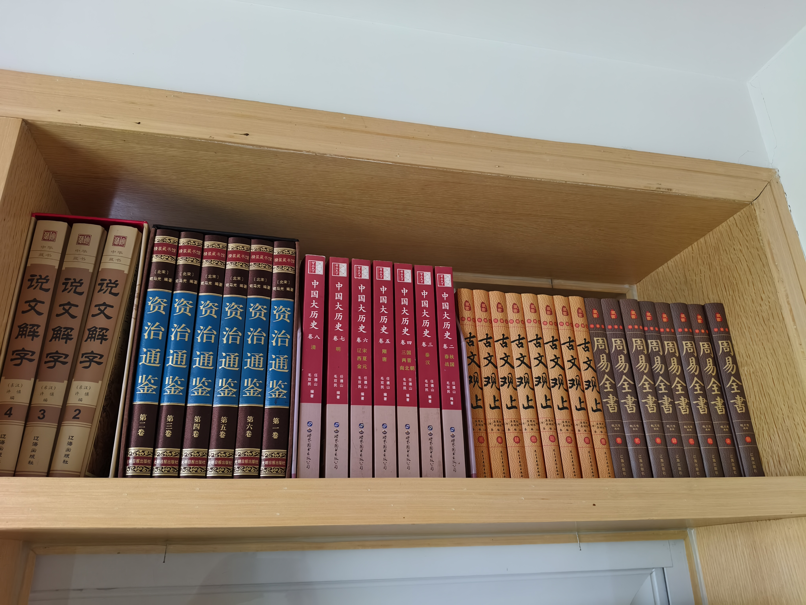
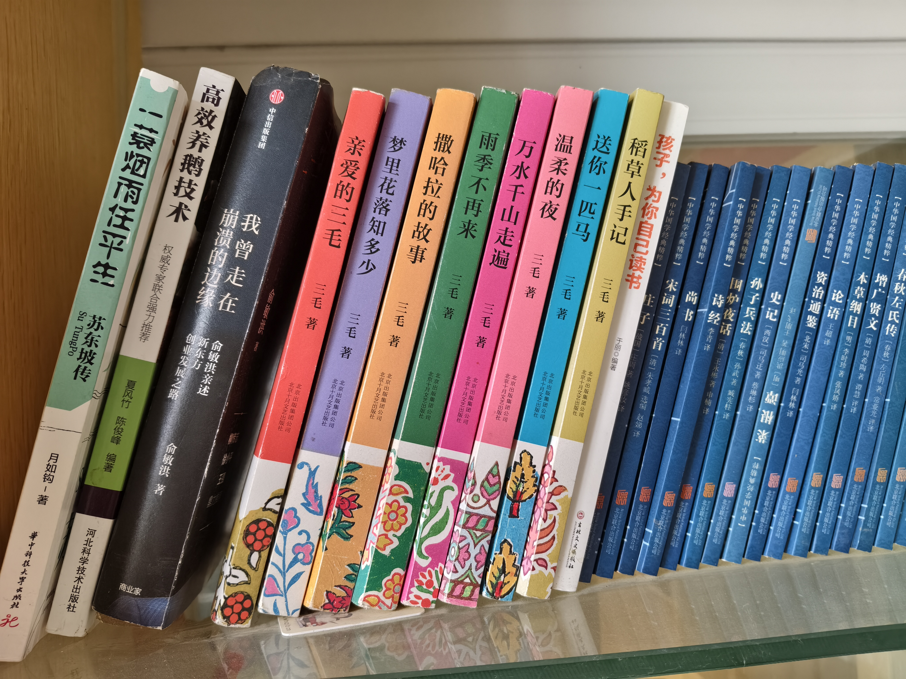
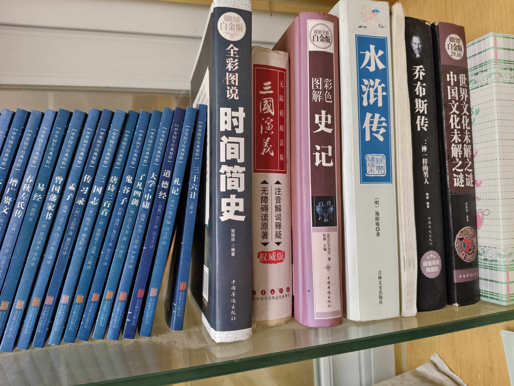
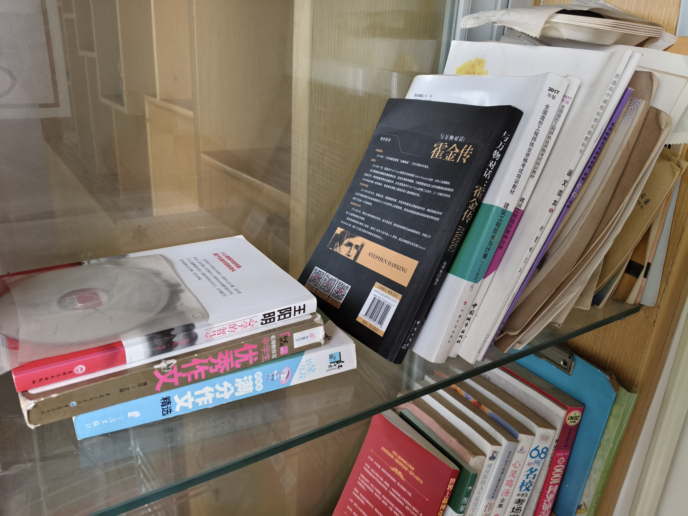
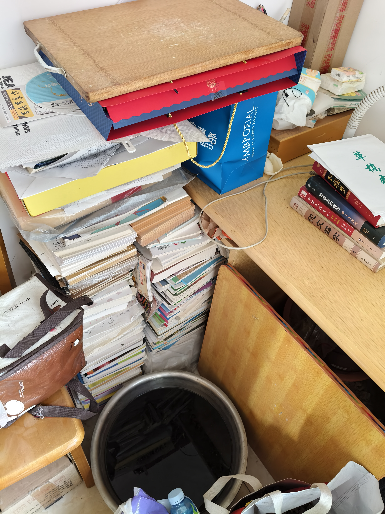
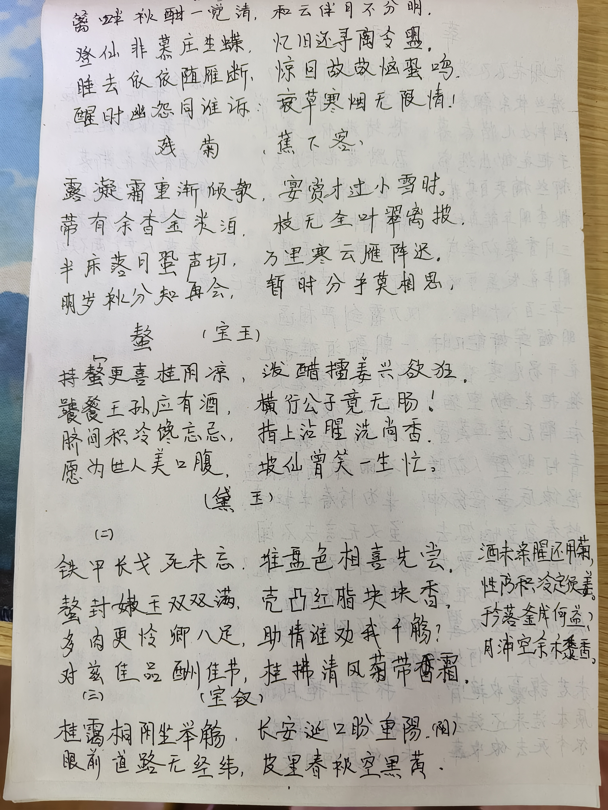
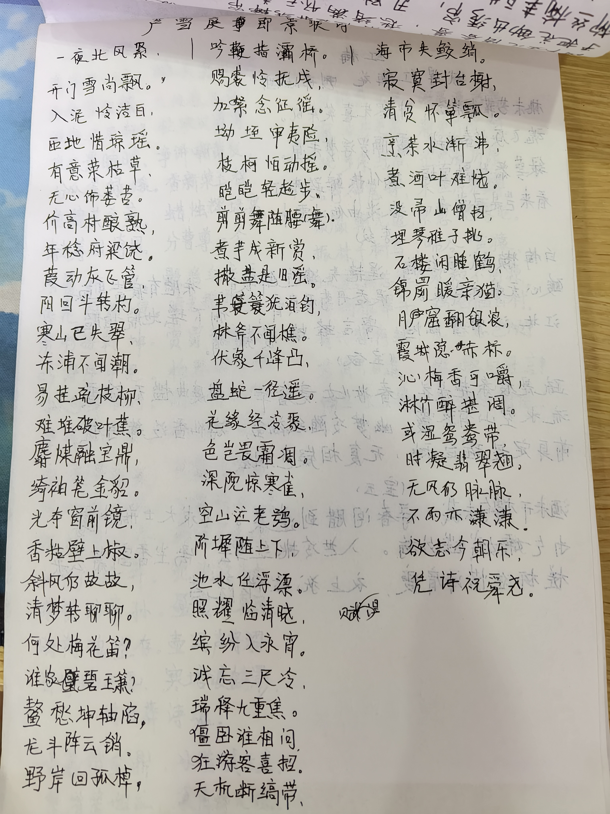

## 即使是日渐稀薄的记忆，我也仍然感觉好多书都找不到了。

### 比如十多本雷欧幻想的《查理九世》、杨红樱的《淘气包马小跳》系列与《笑猫日记》系列、一些《意林》合订版、还有后来的一些轻小说......

 
 

这是家里能找到的一些我看过或者没看完的书籍了。

可以看到还是很杂的。

现在这些书放在客房里，也就是现在我的房间。

而没有放在小书房里的橱窗里，是因为，小书房的橱窗被母亲看的书占了很多，我不想把我看的和她看的混合。

另外小书房里更多的是我从小的一些教科教辅书籍，还有一些本子之类的。

小时候，母亲想把它们卖掉的，因为其他家庭都是这么做的，我极力抗议，遂保留了下来。

还有很多都运到老家放着了，想来那些找不到的小说应该在老家吧。

我也不知道为什么我小时候要留下这些我几乎已经不会再翻看的教科教辅书籍了。

可能我只是喜欢把书籍放旧的味道吧。

可能我期待着我要是能活到老去，翻看这些就像翻看我的一生一样。

可能我在小时候就期待着那种感觉，那种在久经沧桑之后，还能在废墟里找出一本小时候的书籍的欣然感觉吧，毕竟我从小就没有体会到过“欣然”的感觉了。

当然，也可能留下来的目的，根本就不是给之后的我看的吧。

~~就好像我知道我会先一步离开一样。~~

 
 
 

##  一些母亲的书籍

### 母亲已经很久没有收拾这个小书房了，所以看起了很乱，也快成杂物间了，若不是还有个橱窗的话。

 
 

母亲很喜欢诗词，但最喜欢的还是《红楼梦》，这里红楼梦被拿出来了，没有在橱窗里，母亲在家里有难得的闲暇的时候就翻翻。

中药书籍是后来买的，母亲自己也知道自己身体每况愈下，大概是想自己调理一下吧。

可惜她太像年轻时的姥姥了，不允许自己长时间闲下来，总是想着要去做点事情。

 
 

一些古籍书，倒是像极了一个70年代的文人会看的书籍。

除了《资治通鉴》，我不了解，但是父亲说这个是给帝王看的，类似帝王心术，不知道你妈买着干什么。

 
 

一些三毛的书和古籍，母亲把这些三毛的书看遍了。

~~养鹅这本书，母亲兴冲冲的去干，把老家房子改成了鹅窝，臭气熏天，结果是之后给家里带来了一笔巨大的亏损~~

 
 

一些古籍，其中的时间简史和未解之谜应该是我的，时间简史我没怎么看，未解之谜我倒是看了，小学的时候还买过全套的未解之谜，有好多本，什么植物的，动物的，人文的，地理的等等。

乔布斯传我和母亲都看了，虽然这种传记的撰写人一般不是本人，不乏有美化、吹嘘、虚构的成分存在。

 
 

作文书当然是每个孩子上学时少不了的书籍，当然，我还留着各种少时的草稿本、教科教辅书籍。

造价师的这两本是父亲的，父亲应该看过不少这类工程造价的书籍。

父亲很聪明，自学自考的造价师，自己说自己是工程人，不怎么着家。

但转念一想，也算撑起了这个家。

或许没那几本造价师书籍，其他的书籍就都不会有了。

 
 

这里就堆得像杂物间了。

左边是我少时的草稿本、教科教辅书籍，右边桌子上是母亲的书籍。

《红楼梦》就在这里。

母亲看过很多遍红楼梦的TV版本，也翻过很多红楼梦的书籍，听过很多红学家的解说，也做过很多红楼梦的摘抄。

 
 

母亲的字很有自己的形体。

 

家里其实有很多张草稿纸上都有母亲的摘抄，也不知道母亲自己保存了没有。

若是个学生或者年轻人，那应该会好好保存吧。

毕竟能让人忍不住摘抄的诗句，肯定是触动到了心房的吧，更何况母亲是一个许久未曾拿起笔的人。

但如今这些摘抄就夹杂在随意堆放的稿纸中。

