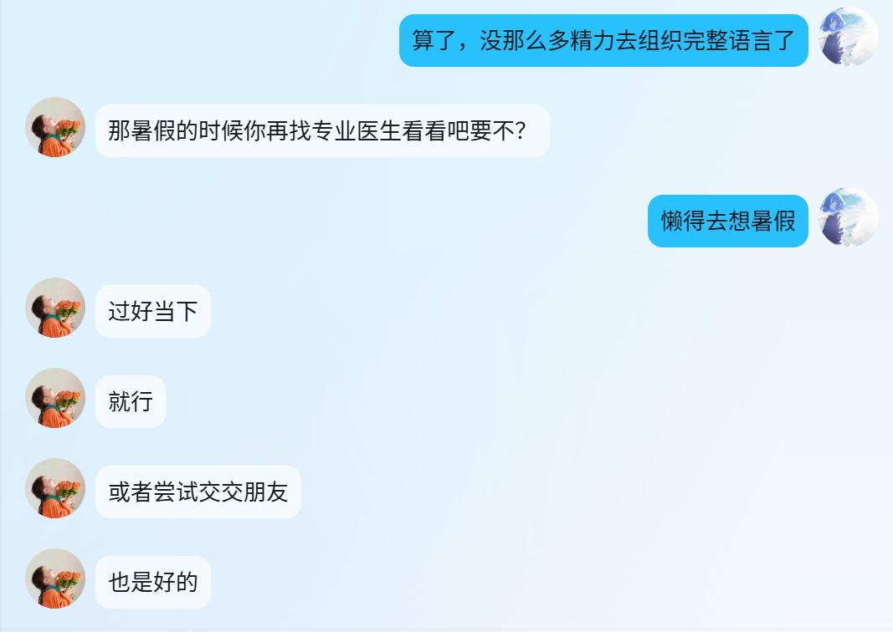
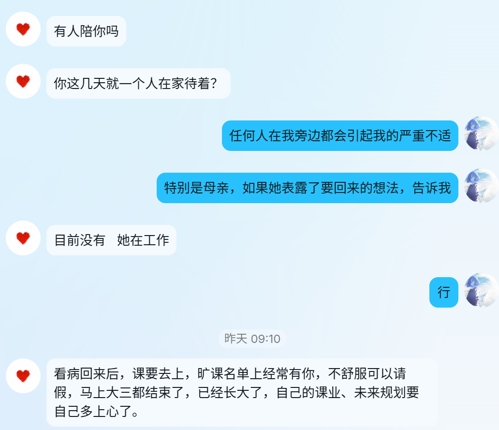
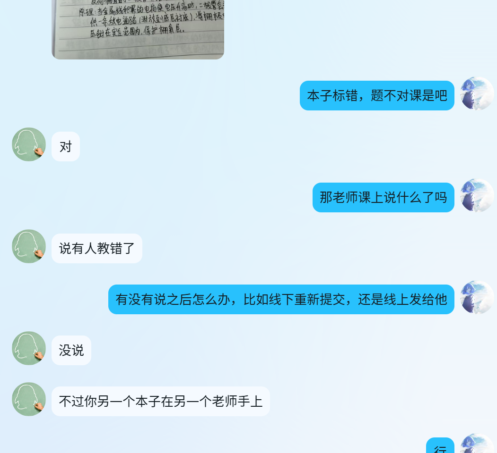
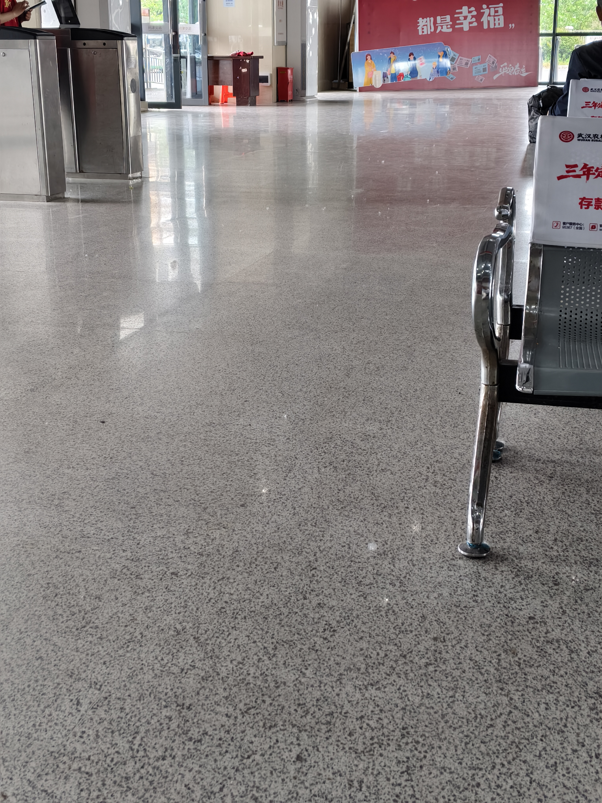

 
## 去学校，失败

#### 2026-05-13下午

&emsp;&emsp;早上心悸早醒的时候，不知道是几点，伴随着的是耳朵被降噪耳机压住的疼痛感。

&emsp;&emsp;倒是晚上应该是1点半过后才睡的，躺在床上心悸很明显。

&emsp;&emsp;再次醒来就是10点多了，起来迷迷糊糊地，洗漱，吃半个面包。

&emsp;&emsp;收拾一下背包，准备去学校拿快递，拿完就回家的。

&emsp;&emsp;这去一趟就要3个小时多，郊区进市区就和乡土文里的进城差不多吧，一个是黄土路上骑自行车或者摩托车，一个是公交转地铁，进城前，路上都没太多高楼建筑，都是些乡野景色。

&emsp;&emsp;也就是说，去3小时，回3小时，在学校处理快递半小时，加上路上一些状况，保险起见7小时。

&emsp;&emsp;这种行程只能上午早早得去，下午黄昏的时候回来。

&emsp;&emsp;在乡土文里，这种一个是在清晨就出发了，然后在城里或是卖东西，或是买东西，亦或是去办些事情，还可能带上一两个村子里的小孩。

&emsp;&emsp;但是我的时间不多了，小区的门前在修路，导致门前的开往很远地方的地铁站的公交不停靠了。

&emsp;&emsp;这就只能，先坐公交去客运站站，再从客运站等车坐到市区了，然后转地铁，再转一次，就能到学校了。

&emsp;&emsp;这样，大概要4小时吧，虽然高德给出的是3小时多，但因为高德地图上大概没计算候车时间，以及车辆进站后司机休息的时间，司机也是人，工作中也是要休息的啊。

&emsp;&emsp;走出小区，走了很长时间，确认了半天小区门口去往地铁站的公交不会停靠后，只能丧气地等去到客运站的公交了，天气有些热，流了很多汗，发梢有些湿了。

&emsp;&emsp;只穿一件短袖的话，会被看出来穿了内衣吧，毕竟我还不pass，还是外搭了一件薄防晒衣。

&emsp;&emsp;这趟公交也不好等，许久后才坐上了去往客运站的公交。

&emsp;&emsp;客运站有些陌生，毕竟我很少出门，在客运站里等了半天，已经12点了，在犹豫要不要回去的时候，那趟开往地铁站的车到了，司机在休息。

&emsp;&emsp;我就看着那车停在那里，一些皮肤黝黑的妇女男人们上车了，两三个年轻人上车了，两三个学生，放完行李箱后，也上车了。透过遮光玻璃窗，隐隐约约看到司机在闭目养神。

&emsp;&emsp;我仍然在犹豫，这时不上车，就真的没机会了吧。

&emsp;&emsp;那既然我犹豫了，那我应该就是不想上车的吧。

&emsp;&emsp;对的，我不想去学校。

 
 

&emsp;&emsp;那是个麻烦的地方，消耗极大，这几天光是学校里面同学、班导师、辅导员发来的QQ信息，都能让我感到极其不适。

&emsp;&emsp;但站在她们的角度，没人任何人做错了什么，不对的大概只是我。

 
 

&emsp;&emsp;班导师会叫我过好当下

 
 

&emsp;&emsp;辅导员会叫我规划未来

 
 

&emsp;&emsp;室友会提醒我作业交错了

&emsp;&emsp;好像在她们眼里，我还没那么病入膏肓。

&emsp;&emsp;可是在我这里，那就是无尽的慌张与焦虑，要是能休学就好了，可惜他们都不建议这么做。

&emsp;&emsp;好像在他们看来，休学如同洪水猛兽一般。

&emsp;&emsp;但我自己想的是，可能不休学的话，在毕业之前我就离开了。

&emsp;&emsp;毕竟我也没办法预测一个天天规划着死亡的人，什么时候会行动起来。

&emsp;&emsp;前额叶的精力也是有限的啊，前额叶也是需要休息的啊。

 
 

&emsp;&emsp;那就回家吧。

&emsp;&emsp;其实在客运站候车大厅的时候，我就有些不适了，就如同我说中的那样：任何人在我身边，我都会感到不适。

&emsp;&emsp;世人若是看到一个男人，那就在脑子里就会打上个“男人”的标签，然后就不去在意了，除非这个男人很帅，便最多多瞧几眼，打上一个“帅”的标签。

&emsp;&emsp;若是看到一个女人，那么就会打上一个“女人”的标签，然后就不去在意了，除非这个女人很美，也最多多瞧几眼，打上一个“美”的标签。

&emsp;&emsp;但是若是看到一个不男不女的人，或者一个阴柔的男人，亦或是一个飒爽的女人，那么就会多留意几眼。

&emsp;&emsp;目光就会盯着Ta，试图在脑海非要里给Ta贴上标签不可。

&emsp;&emsp;一些开放的年轻人还好，不会太盯着。

&emsp;&emsp;但是一些老一辈就会，不仅盯着Ta看，还会跟随你的目光而转动脑袋。

&emsp;&emsp;简直是一场目视审判。

&emsp;&emsp;我这郊区里，老一辈是最多的，车站里也见不到多少年轻人。

&emsp;&emsp;这种目光我见多了，真的很不适。

 
 

&emsp;&emsp;出站口中了好几坛花，紫的黄的白的，慵懒地开着，静静地，任轻风抚携，平静地目送着一茬一茬的学子游客，不带任何审视，不上任何标签。

&emsp;&emsp;大概我是想种花的吧。

&emsp;&emsp;回绝了上来邀客的摩的司机。

&emsp;&emsp;等回到小区门口前一站的公交车吧，然后再走回去。

&emsp;&emsp;小背心的一圈是最热的，汗湿了许多。

&emsp;&emsp;这天气，开个空调不过分吧，应该。

&emsp;&emsp;再见了。