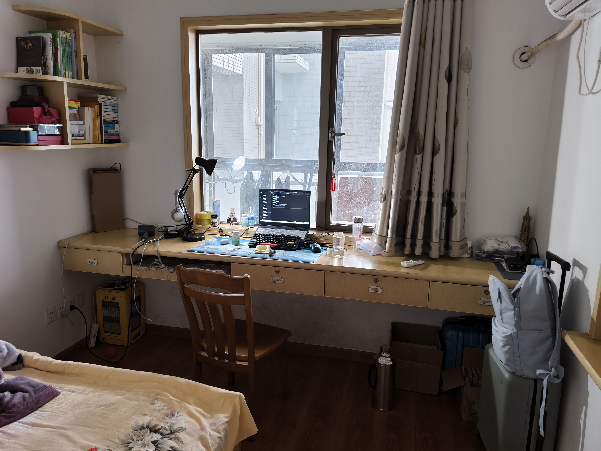
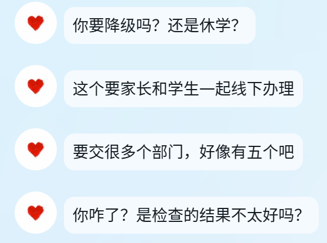
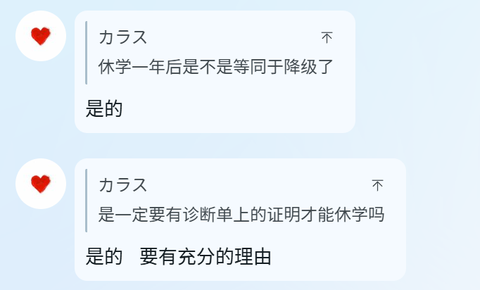

果然没吃药。

今日闭眼时间2点16，入睡时间2点40左右。

睡后不知道什么时候，噩梦梦到自己还是高中生，要5点多早起去赶着上早自习，直接惊醒。

后续继续睡觉，早醒时间：6点半左右。

强制困意后，继续睡到9点。

---

父亲做了午餐

依旧是好几个菜加汤

比母亲做的丰盛的多

味道也好的多

厨房有些脏了

明天他就驱车去外省上班了

明天拖一下厨房的地吧

顺便把厨房做个小扫除

他要是懒得洗碗那就我来洗吧。

---

下午想收拾自己的房间了，也就是被赶往的客房

有些累，但好在几小时的努力有些效果

房间干净整洁了很多

清理出了很多垃圾

以前没吃激素的时候是根本不想干这些的

现在干着居然开心了许多

顺便把地一扫一拖。

就是这窗子需要刮窗子的工具才能洗干净了

下次吧。

---

下午后半段和父亲深度交流到了夜里

录音都录了2h

而且前面的部分和后面的部分还没录到

我感觉我讲的还行吧

毕竟是我深度思考过的东西

不过想要改变他们的想法很难了

只能是不反对了

对了，这次不是性别方面的交流

只是抑郁方面的

举了一些例子告诉了他抑郁是生理心理社会层面多方面左右的结果

也告诉了他我为什么想休学

这些要是说给母亲

她很难理解吧。

父亲说她是一个极度以自我为中心的人

---

三天后是我的生日

5月20日

以往很多年

我无数次想在这个日子死去的

这个在现在社会里被赋予了“我爱你”的日子

恰好撞上了我的诞生日

要是在那一天死去

又撞上了我的忌日

真是浪漫吧

可今年只希望能顺利休学

然后那天母亲不要出现

她要是真现身了

我一天都不好过的

不对，一周都不好过的

那说不定就会吃药了，直接od了都。

---

休学问了辅导员

要学生和家长双方线下办理

要跑五个部门

光是待在学校什么都不做都是个极度消耗的活

我更没有那么多精力去跑部门了

更不想去麻烦父亲了

他得去工作

算是我唯一的经济来源

母亲不给我钱的

从小到大，母亲只会让我向父亲要钱

当然我也不想叫母亲回来

还是一个人在家里好

可惜在学校看来这是没有手续的，是非法的

哎

到时候被勒令退学怎么办

没有大学文凭了

退学就退吧

无所谓了

我也不知道能不能活过明年生日

---

父亲去上班后真就是一个人了

虽然感觉母亲到时候因为学校方面的原因

肯定会回来

但中间这几天还是要过的

做饭 炒菜 洗碗 拖地

我想找回一点生活的实体感

不然总是隔着一层雾看世界

解离了一般

就像在学校里那样

什么感觉都没有

除非给自己划几刀

但是我太社恐了

去小区外面的超市买生鲜都怕得要死

这地方也没有能送货上门的生鲜超市

还真是害怕呢

而且也不会处理食材

特别是肉类

去腥 裹粉 腌制 什么的

像笨蛋一样。

---

