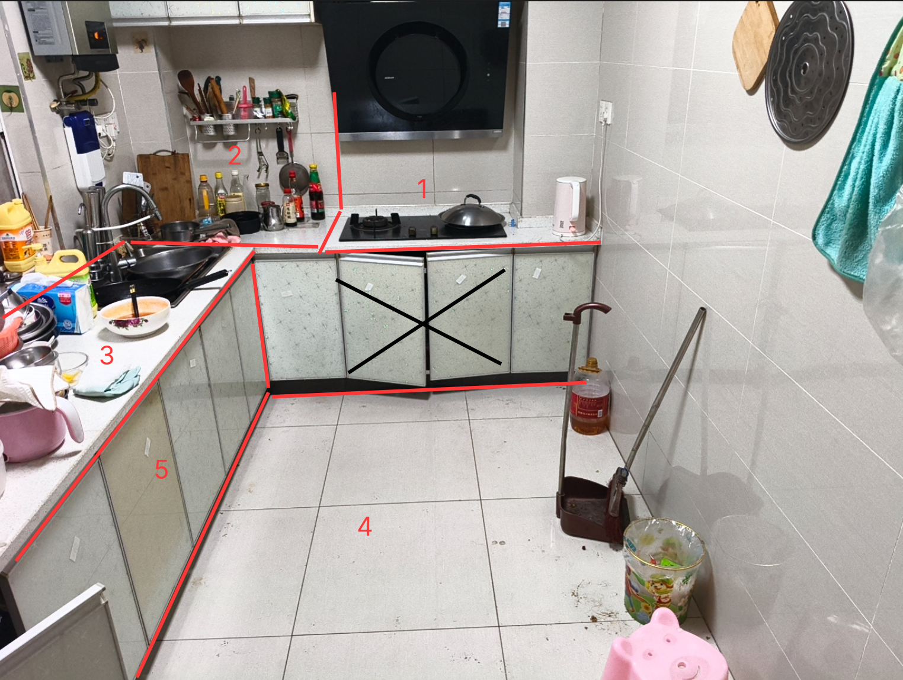

晚上7点，趁着还没忘记今天的事情，来写一下。

闭眼时间1点20左右，入睡时间1点40左右吧。

期间醒来时间5点58，但这次是迷迷糊糊的，有睡意的。

再次醒来就是8点半左右了。

睡眠貌似好转了些。

可能是家里没人的原因，毕竟一个人还是自由些。

不见人，人际焦虑啊、性别焦虑啊也少了些。

---

早上煮了俩荷包蛋吃

煮蛋的技术还需精进练习

---

上午整好了昨天开始整的整合包

简单加了些自己想研究的模组

神化、铁魔法、灾变啥的

然后去取了一次快递

新鼠标和烟酰胺精华

不得不说

这才127天的hrt就下降这么多

倒也还算欣慰

可惜，怎么不掉掉小腿大腿上的肌肉啊？

驿站都在小区里，走过去走回来

蒸起一层薄汉

也可能是我走得太快的原因

可惜已经快成习惯了

倒是驿站的妇人挺和蔼的

或许那句

颜值打扮一上来，就会感觉周围的态度全变好了些

是对的

虽然我现在看起来仍然是个清秀的留着包头头发的男生

可能更接近非二元的外在表达

要是脸小一点，下巴不那么方，雀斑少一点，眼内角没那颗明晃晃的痣

那我说不定还真能坚定我是mtf了

只是对于我来说，到mtx对性别焦虑的缓解就有些足够了

当然，能pass更好

可惜这个想要pass的代价有点大了

---

开空调

玩到了11点半吧

开始去做饭

倒是发现父亲走前留下的豆子过期了，有些味道了，遂丢弃

换做母亲可能还会拿来煲汤吧

父亲临走前留下的卤牛肉，四块，一块好大啊，还留了几袋卤水

还有一些菜，比如番茄

刚好还有些父亲没回来的时候买的泡面

那就刚好，煮个茄皇番茄牛肉鸡蛋面

直接拿锅煮

虽然现在的力量拿装满水或者汤的锅有些颤抖了

但还是要熟悉锅的使用

打个蛋在里面

把面条挑出来些，放进大碗里

然后其他的汤汁牛肉鸡蛋直接倒进大碗就行了

当年第二次休学的时候，在老家煮面也是这样的

算不上美味，但是能入嘴

---

找个长片子当电子榨菜

看完吃完先就不洗碗了，下午洗吧

接着玩玩mc，玩玩明日方舟，刷刷X

---

下午2点20父亲发来关心的消息

---

然后就困了，睡觉

mc在挂机钓鱼

---

起来后应该已经是5点多了

记不清了

两个选择

跑步机上上爬坡或者处理厨房

当然，要先洗碗洗锅

不然爬坡之后就什么都不想干了

我选择了后者，处理厨房

算是想做个大扫除

这个任务好像有些艰巨

对于我这种低精力的人来说

需要分块进行

倒是睡前点的闪购，一是整些罗森的面包汽水（无糖可乐和魔爪）

二是买了些厨房用具

比如手套、新洗洁精、洗碗布、灶衣

中午的煮面就告诉了

厨房会惩罚每一个进来不穿灶衣的人

就先洗碗洗锅，然后进行了1组的清洗

就累了

倒是顺便收拾出了很多母亲喜欢留着的垃圾

比如外卖的餐盒

她总是把那些餐盒洗干净后留着

比如老乡鸡的、大米先生的、海底捞的

这下都是我前些年，大晚上抑郁，食欲爆发的时候点的外卖

这些塑料外卖盒不说塑化剂了

就算是长久放在厨房里

沾染了油污

也会小范围惹得一些异味

干脆全扔了！

哈哈，成年后对母亲的叛逆就是可以扔掉母亲“珍藏”的“垃圾”啊！

下次试着清理一下冰箱？

先把厨房分块清理完吧

地板是第四个清理的

那中间只能忍忍啦

橱柜里应该也有一些需要扔和洗的东西

想想就累

那就先不想了

晚上处理掉昨天点的十翅一桶

再洗个澡

试试从学校带回来的磨砂膏用在其他部位怎样，之前只用在手上的

再试试烟酰胺精华到底能不能像X里的帖子说的那样，可以去晒斑

毕竟我这皮肤，见太阳就起斑的（可能遗传了母亲年轻时的好皮肤，毕竟青春期都没怎么长痘）

少时因为这个原因，留下了一堆斑

别人晒太阳是放松心情，我是如临大敌

下次上跑步机爬坡是什么时候呢？

---

今天状态比在学校好多了

在学校老想着自残自杀

我是真怕自己死在学校了

毕竟我研究过的自残和自杀方式太多了

在家里还能亲手试着生活一下

虽然到现在还没弄到诊断证明来休学

---

