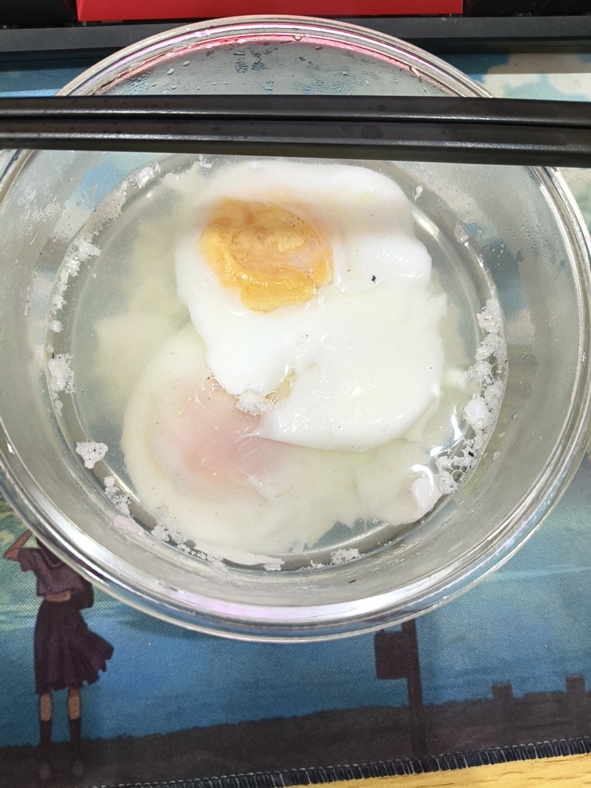
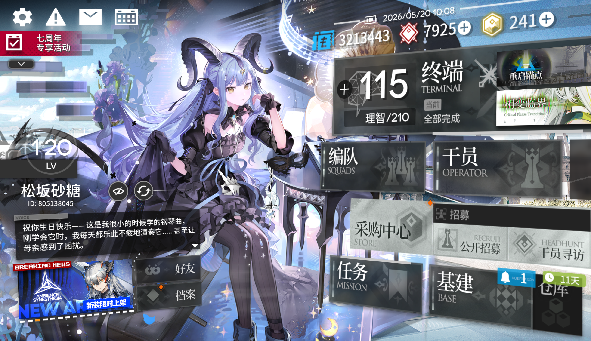
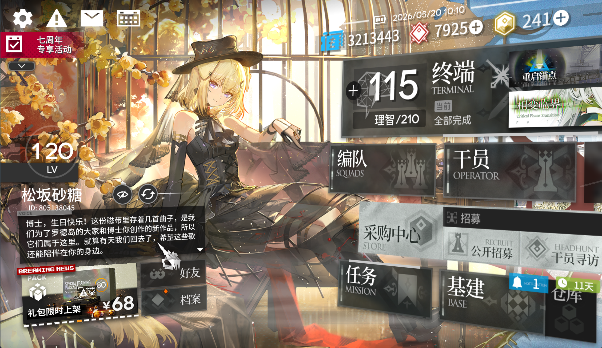
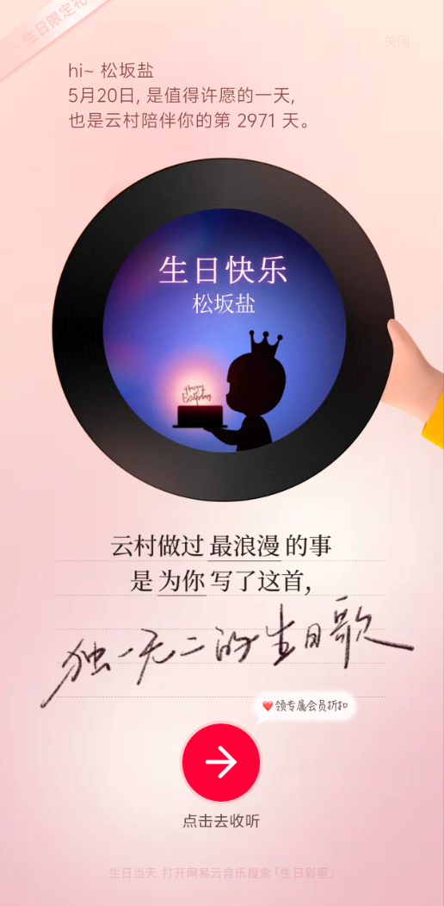

闭眼时间1点半，入睡时间大概2点

醒来的时间7点11分，也是带有睡意的迷迷糊糊的醒来的

这个应该不算早醒，起码不是像在学校里那样4点就醒了，还睡不着

这次醒来没感受到心悸明显，在学校那是真的心悸明显

后继续睡觉，到9点40左右醒来，有正常的困意，一段时间后，可以起床了

睡眠应该是变好了些，暂时

---

醒来看到父亲发的生日红包

虽然我早就懒得过生日了

但是父亲或者母亲还是会在这一天发个小红包

还得记到记账软件里面去

那个红包后面的文字仍然是父亲走之前的那句话：早日战胜病魔，恢复健康

真能战胜吗？

只能缓解吧

况且性别这一块父母双方不同意，那不是仍然只能缓解吗

算了，今天先不想这一块

---

煮荷包蛋

我貌似摸出了一点方法了

虽然从出生到现在，自己煮鸡蛋的次数没超过5次

但是煎鸡蛋倒是在初中、高中、休学的时候试过好几次

荷包蛋方法嘛，我想想

大概是先把水煮开

然后盛出来一些，留下小锅的水

改为小火

垂直在水面上打入鸡蛋（现在不可能出现烂鸡蛋售卖了把，不可能的吧，我可不想一个鸡蛋毁了一锅）

一会后，看到些许白色絮状物（蛋清）

然后拿大勺子在周边慢慢搅动，免得蛋清粘锅底

就只会散出一点蛋清出来

大部分蛋清还是围在蛋黄旁边的

等到蛋黄旁边一圈的蛋白完全凝固后，小火煮一会，然后可以转大火了

这次转大火是为了将蛋黄固化

毕竟我喜欢吃表层固化，最里层带一点溏心软软的

一口下去，软软的那层是深色的，带有一种奶油的口感

少时母亲给我做的荷包蛋就是这样的

怎么判断是否达到表面固化，里层溏心了呢？

大火煮的时候，拿大勺子轻轻按压一下蛋黄的部分

若是刚好从能按下去到按不下去（按下去有一定阻力）

那就差不多了

再稍微煮一小会就好了，就可以盛出来了

 
 
 

下次说不定可以试试蛋花汤，那个得加点糖，也是少时经常让母亲给我做的

---

 
 
 

 
 

 
 

 
 

---

