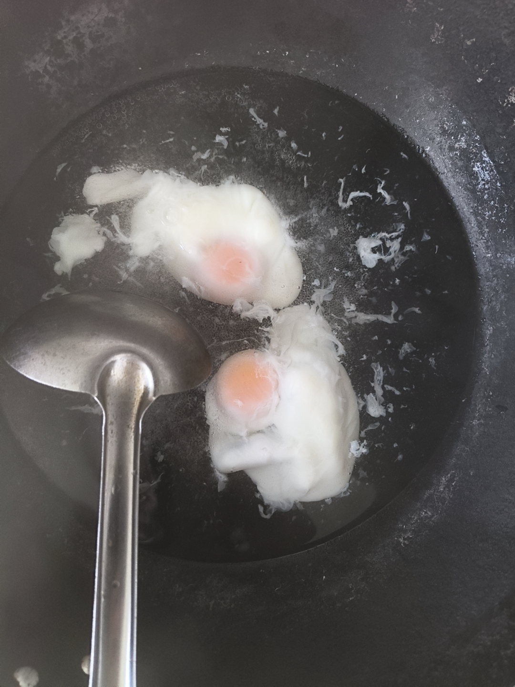

闭眼时间 凌晨3点20左右

入睡时间 大概3点40左右

醒来时间 大概9点20左右

睡眠变差了

大概可能是因为喝了魔爪，然后还想起了母亲的一些事情

总之起床后状态很糟糕

或许我该吃药了

我在想，我为什么不想吃药呢

从初中开完第一次药之后

我就没吃过

因为我很早就了解到了抑郁症这些精神疾病了

我也知道那些药一吃可能就是十年半载

或者一辈子的事情了

我也知道我的心理精神状况有多么糟糕

我在煮荷包蛋的时候

大概想出来了一个结果

我害怕的不是吃药

我害怕的只是“一次开始”

因为你知道的，开始之后，就很难结束了

心理方面会有持续病耻感

这是经典的“没病别上医院”造成的

精神方面会有依赖性

这是药物作用于生理造成的，类似于成瘾性物质一样

经济方面会持续花钱

这是少时家里糟糕的教育，加之拮据的经济条件，经常叫我别乱花钱造成的

这些，在服药开始后，都可能会加重抑郁焦虑

所以某种意义上，我不想吃药的最大原因可能就是

害怕开始

恐慌未来

什么药物依赖啊、药物滥用啊、服药自杀啊之类的

---

但是我病态的心理居然有了这样的想法

既然对未来不抱任何希望了

也就是活不到未来了

那么为什么不现在就吃药

起码让现在精神一点呢

起码还能看看喜欢的书

玩玩喜欢的游戏

在跑步机上爬爬坡、减减脂

清理一下厨房

对啊

如果根本不打算活到3年5年后

那现在不就相当于是最后一段时光了吗

在最后的一段时光

不应该稍微精神一点

干些自己想干的事情了吗

当然，这以前的前提都是那个病态的畸形心理

或者说是“根本活不过明天”

如果是这样的话

心底对美好未来的幻想，对正常日子的期望

都会拉扯着这个病态的心理

于是它们打起来了

打出来一片焦虑、不安与恐惧。

---

我还是开始吃药了

先从文拉法辛开始吧

晚上试试劳拉西洋

如果不吃这些的话

我能明显感受到，不按医嘱办的话

医生会消极问诊的。

---

ai了一下这两种药物的一些信息

可以说是非常保守的用药了

ai说还得记录一下用药期间的各种状况

那就顺带在这里记录好了

希望我还有精力码字

早上起来那会是真的啥都不想干了

就在床上干躺着

---

昨天看到了一个新的煮荷包蛋的插入步骤

就是先拿开水烫鸡蛋1分钟

然后在打入锅中

我采纳了这个插入步骤

感觉还不错

蛋白比昨天在锅里散的少了

 

 
 
 

---

果然状态不好

像是在学校里一般

中午吃外卖

也只吃了一点，大概单人餐的一半都没到

和在学校一样

吃完立马就想上厕所了

紧接着肚子疼

腹泻

腹泻完就没力气没精力了，连在这里打字都费劲

需要时不时停下来缓缓

也和在学校一样

在学校几乎每两三天的中午都这样

那句情绪影响肠胃是对的

可现在肠胃也会反过来作用了

下午还想清洗一组已经分好的厨房组的

晚上就把剩下的外卖热一热吧

先吃片维生素b。

