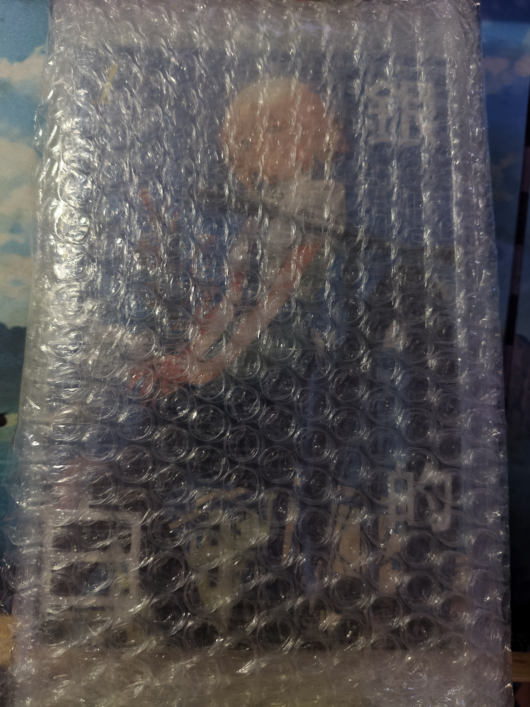
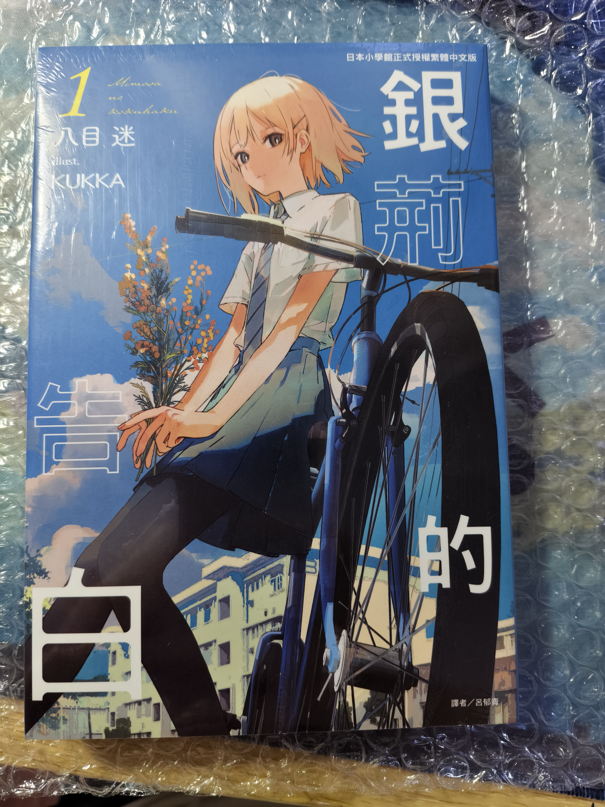
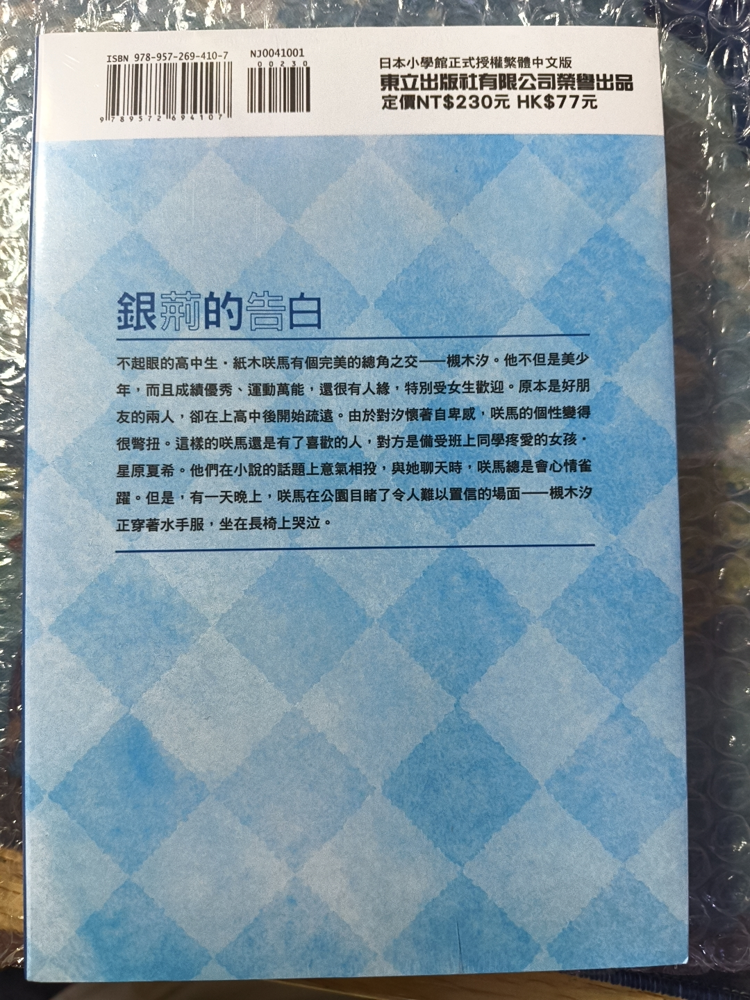
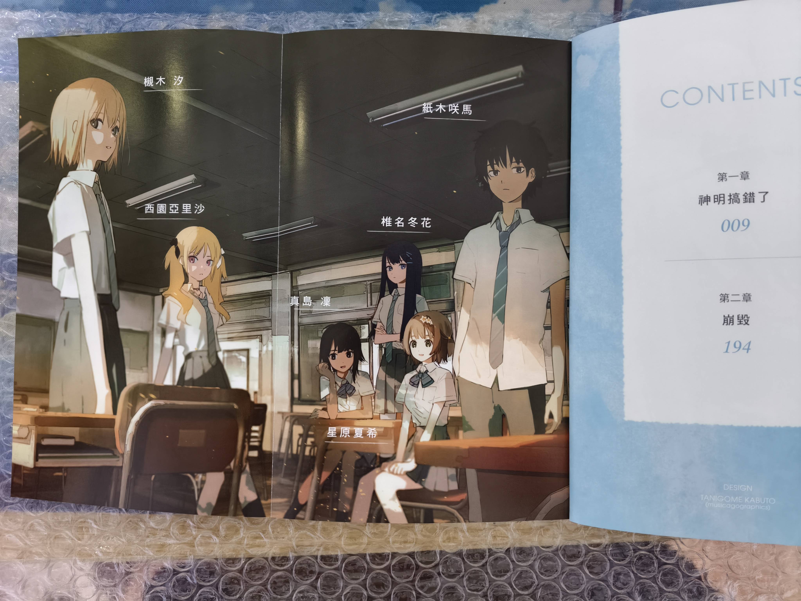
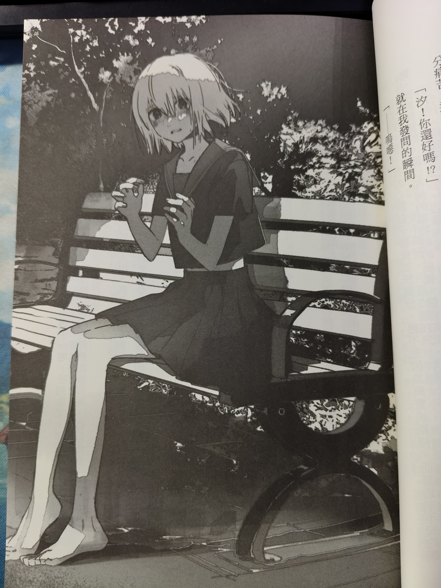

闭眼时间0点12分

入睡时间大概0点25分

醒来时间7点半左右

后困意睡去

再次醒来时间8点50

仍然乏力。
---

上午乏力

中午煮了俩荷包蛋

吃了个面包

机械式刷着手机

中间好像还玩了会明日方舟

但是我忘记了

明明是一天之内的事情的

到了下午4点多的时候

想睡午觉

或者应该叫下午觉了

但是附近的一层在装修

虽然降噪耳机能降下来一些

但是鉴于中午吃了文拉法辛和维生素b

所以没睡着

躺了一会下床

好像又不记得干了些什么了

总之时不时在打开手机盼着快递到站

睡衣已经到了

在盼着《银荆的告白》

---

晚上点外卖

一天没摄入肉类的蛋白质了

也不知道光凭俩鸡蛋能不能满足每日所需蛋白质的60%

外卖到的时候

《银荆的告白》也到了

一路上像往常一样走的很快

驿站的老头也和蔼

只是回屋的路上

三三两两的老婆婆盯着我看了会

估计是想分辨出是男是女吧

好在天黑了

而且我也走得很快

 
 

---

可惜天黑了

我没精力看这本书了

其实或许我应该读出来

如果我长期不开嘴

失语的症状就会越来越严重了

即使读这些书面的语音

在以后需要口语的场合会有些奇怪

虽然之前和为数不多的朋友和同学交流的时候

也经常蹦出些只会出现在书面上的语言

但能开口应该就算好的吧

---

 
 

 

随便翻翻就能翻到这张插图

一瞬间就让我想起了初中时自己凌晨离家后，想离家出走却又无所去向

只能在大街上晃

晃累了就回到小区

也是坐在这样的长椅上

深夜

小区绿化林

低矮的灌木细碎切割着路灯

虫鸣低沉，倒也不噪

长椅有些掉漆

我有些哭泣

不过我并没有穿什么水手服女装之类的就是了

毕竟都解离麻木了

性别方面的探索早就不在乎了

毕竟已经写好遗书了......

 
 

不久后

或是母亲或是外婆

朝这个方向过来了

应该是马上要找到我了

那得赶紧擦干眼泪了

后来的，也忘了

