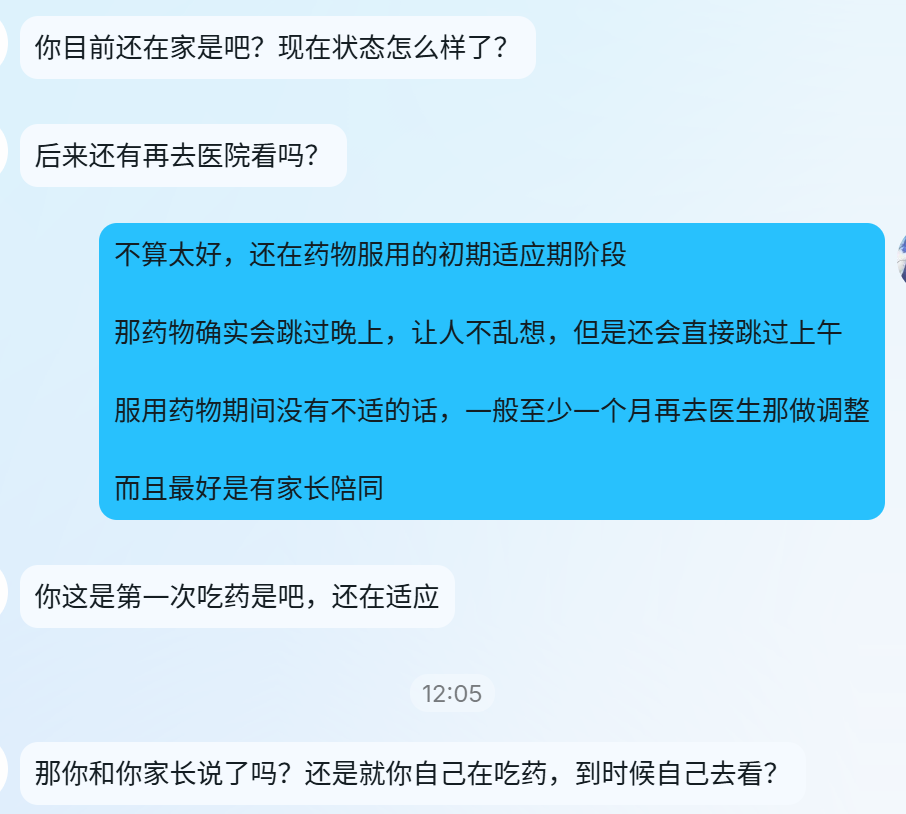
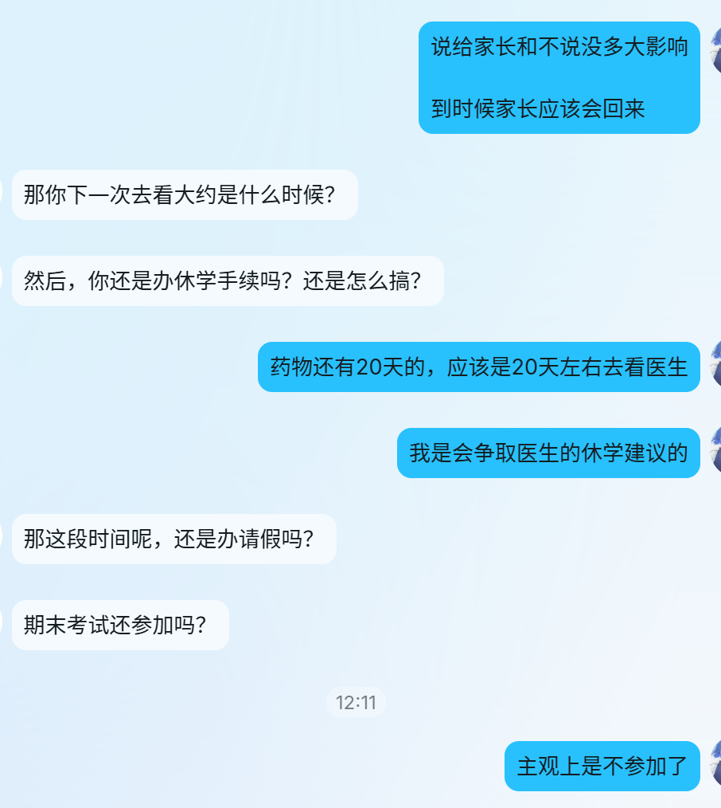

今天头痛

辍笔不耕

可能是昨天母亲说不回来了

说是请不动厂里的假

还说打算六月辞工

现在厂里一天13小时  两顿饭的时间只有半小时

工资也不怎么样

也可能是今天辅导员又联系我了

说了一堆休学啥的计划事项

我还得打起精神来思考规划这些

一想到学校就莫名心悸

然后就开始头痛

好像还是偏头痛

右边的痛些

然后带着右眼也痛

下午也没力气

躺在床上也睡不着

只能昏昏迷迷地眯着

期间还把毯子掀了

着了凉

这下肚子跟着痛起来了

这糟糕的生理状况

会导致糟糕的心理状况的

比如会想到自杀

比如会想到买亚硝酸盐的渠道

比如会想到亚硝酸盐很苦

所以得装在胶囊里送服

比如......

总之今天头痛

辍笔不耕

