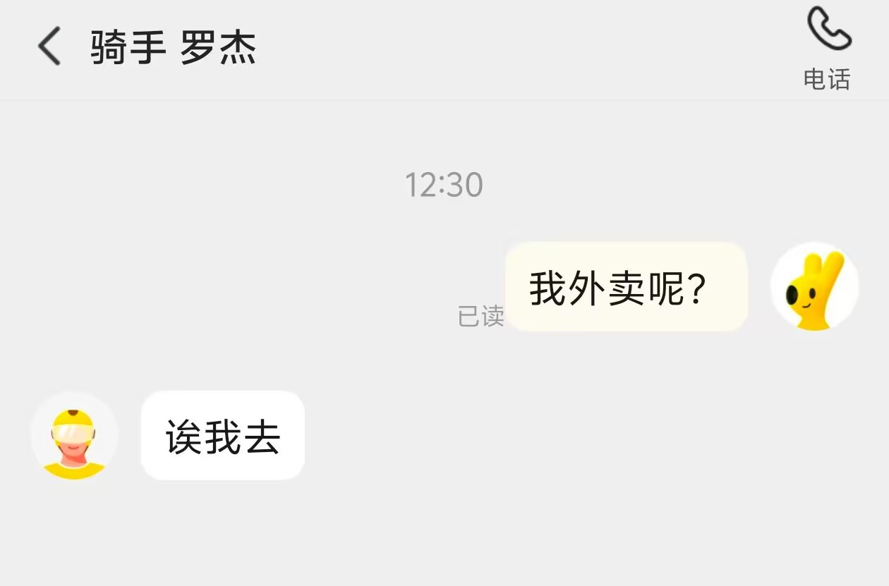

 
今日早醒时间：5点48。

上午干啥了，我忘了，好像外卖小哥送外卖，送我同栋的上一户，点击送达，没送给我就走了，但是电话里声音很开朗豪迈，后面加急送给来了，笑笑了之了。

 

计算了一天的营养摄入量：

能量：81.8%

蛋白质：76.8%

脂肪：95.7%

碳水：74%

钠：156.8%

 

中午吃的罗森便当，顺便买了点魔爪和面包，粉魔爪是真酸啊。

难得睡了午觉。

起来码字，挂明日方舟，刷了点长视频，整理了一下书籍，接着码字。

上跑步机上爬坡，抬高到13°还是13%来着，不记得了，45分钟左右，显示里程3km。

拉伸，泡沫轴，洗澡。

吃一个面包，热一个饭团，吃了12mg色谱龙，来了一瓶白魔爪，虽然功能性饮料都酸，但这个比粉魔爪要好些。

看点长视频，码字到深夜凌晨1点。

魔爪喝了是真睡不着吧，都不用吃b族维生素了，毕竟魔爪里自带了。
